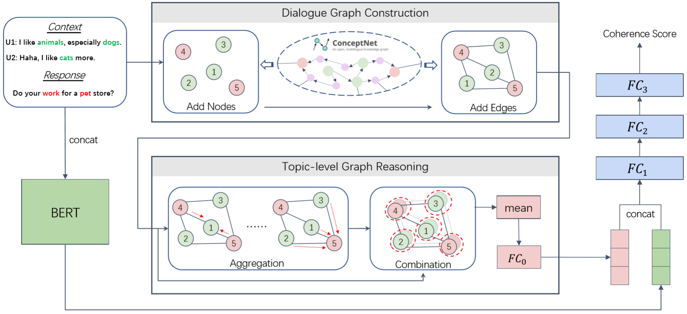

# **GRADE**: Automatic Graph-Enhanced Coherence Metric for Evaluating Open-Domain Dialogue Systems


This repository contains the source code for the following paper:


[GRADE: Automatic Graph-Enhanced Coherence Metric for Evaluating Open-Domain Dialogue Systems](https://arxiv.org/abs/2010.03994)   
Lishan Huang, Zheng Ye, Jinghui Qin, Xiaodan Liang; EMNLP 2020

## Model Overview


## Prerequisites
Create virtural environment (recommended):
```
conda create -n GRADE python=3.6
source activate GRADE
```
Install the required packages:
```
pip install -r requirements.txt
```

Install Texar locally:
```
cd texar-pytorch
pip install .
```

Note: Make sure that your environment has installed **cuda 10.1**.

## Data Preparation
GRADE is trained on the DailyDialog Dataset proposed by ([Li et al.,2017](https://arxiv.org/abs/1710.03957)).

For convenience, we provide the [processed data](https://drive.google.com/file/d/1sj3Z_GZfYzrhmleWazA-QawhUEhlNmJd/view?usp=sharing) of DailyDialog. And you should also download it and unzip into the `data` directory. And you should also download [tools](https://drive.google.com/file/d/1CaRhHnO0YsQHOnJsmMUJuL4w9HXJZQYw/view?usp=sharing) and unzip it into the root directory of this repo.

If you wanna prepare the training data from scratch, please follow the steps:
1. Install [Lucene](https://lucene.apache.org/);
2. Run the preprocessing script:
```
cd ./script
bash preprocess_training_dataset.sh
```


## Training
To train GRADE, please run the following script:
```
cd ./script
bash train.sh
```

Note that the [checkpoint](https://drive.google.com/file/d/1v9o-fSohFDegicakrSEnKNcKliOqhYfH/view?usp=sharing) of our final GRADE is provided. You could download it and unzip into the root directory.

## Evaluation
We evaluate GRADE and other baseline metrics on three chit-chat datasets (DailyDialog, ConvAI2 and EmpatheticDialogues). The corresponding evaluation data in the `evaluation` directory has the following file structure:
```
.
└── evaluation
    └── eval_data
    |   └── DIALOG_DATASET_NAME
    |       └── DIALOG_MODEL_NAME
    |           └── human_ctx.txt
    |           └── human_hyp.txt
    └── human_score
        └── DIALOG_DATASET_NAME
        |   └── DIALOG_MODEL_NAME
        |       └── human_score.txt
        └── human_judgement.json
```
Note: the entire human judgement data we proposed for metric evaluation is in `human_judgement.json`.


To evaluate GRADE, please run the following script:
```
cd ./script
bash eval.sh
```

## Using GRADE
To use GRADE on your own dialog dataset:
1. Put the whole dataset (raw data) into `./preprocess/dataset`;
2. Update the function **load_dataset**  in `./preprocess/extract_keywords.py` for loading the dataset;
3. Prepare the context-response data that you want to evaluate and convert it into the following format:
```
.
└── evaluation
    └── eval_data
        └── YOUR_DIALOG_DATASET_NAME
            └── YOUR_DIALOG_MODEL_NAME
                ├── human_ctx.txt
                └── human_hyp.txt
```
4. Run the following script to evaluate the context-response data with GRADE:
```
cd ./script
bash inference.sh
```
5. Lastly, the scores given by GRADE can be found as below:
```
.
└── evaluation
    └── infer_result
        └── YOUR_DIALOG_DATASET_NAME
            └── YOUR_DIALOG_MODEL_NAME
                ├── non_reduced_results.json
                └── reduced_results.json
```
